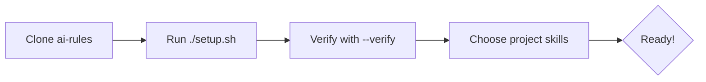

# 🚀 Onboarding: Welcome to the Migasfree Community

Welcome! This repository, `ai-rules`, is the heartbeat of our AI-assisted development process. It defines the **Standardized Specifications** that ensure every developer, analyst, and writer in the Migasfree community works in harmony.

## 🌟 Why Standardized Prompts?

In a distributed community like ours, consistency is key. By using this repository, you ensure that:

1. **AI Personas are Consistent**: A "Python Developer" means the same thing to your AI assistant as it does to ours.
2. **Workflows are Automated**: We share the same scripts for auditing, committing, and generating code.
3. **Quality is Enforced**: specialized roles (like Security Engineer) automatically check your work against our specific best practices.

## 🛠️ Getting Started

### ⚡ Quick Start Visual



### 1. Prerequisite: Antigravity

Ensure you have the Antigravity AI agent installed and configured.

### 2. Install the Standards

We follow a **Hybrid Installation Strategy**: Core roles are global (always on), while technology skills are installed per-project to keep the context clean.

```bash
# 1. GLOBAL: System-wide Workflows & Core Roles
./setup.sh

# 1.1 VERIFY: Check installation and versions
./setup.sh --verify

# 2. LOCAL: Project-Specific Skills
# Navigate to your specific project folder and run:
mkdir -p .agent/skills
# Then copy ONLY the skills you need from the skills/ folder:
# cp path/to/ai-rules/skills/languages/python-expert.md .agent/skills/
```

### 3. Verification

Run the following command in any project to verify your installation:

```bash
/skill_list
```

You should see a list of Migasfree Core roles (e.g., `technical_lead_architect`) and active Skills (e.g., `python-expert`).

## 🎭 Your Role in the Community

Depending on your contribution, you should activate different "Skills" for your session.

| **Architecting** | `Technical Lead & Architect` (Global Role) | Patterns, security-by-design, ADRs |
| **Operations** | `Solutions & Operations Lead` (Global Role) | CI/CD, packaging, reliability |
| **Designing** | `Product & Experience Designer` (Global Role) | UX/UI, accessibility, user flow |
| **Developing** | `Python Expert` (Skill) | Idiomatic Python, mTLS, performance |
| **Dev Desktop** | `Electron Expert` (Skill) | Secure IPC, native integration |

### How to Switch Roles

You can enable/disable skills dynamically:

```prompt
/skill_on technical_writer
/skill_off python_developer
```

## 🤝 Contribution Guidelines

1. **Always use the `/commit` workflow**: This ensures your commit messages follow our Conventional Commits standard.
2. **Run an Audit before PR**: Use `/audit_report` to self-check your work against our quality gates.
3. **Improve the Standards**: If you find a prompt that can be improved, submit a PR to *this* repository!

Happy Hacking!
The Migasfree Team
