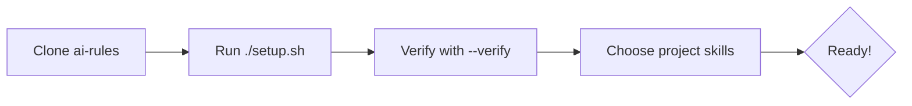

# 🚀 Onboarding: Welcome to the Migasfree Community

Welcome! This repository, `ai-rules`, is the heartbeat of our AI-assisted development process. It defines the **Standardized Specifications** that ensure every developer, analyst, and writer in the Migasfree community works in harmony.

## 🌟 Why Standardized Prompts?

In a distributed community like ours, consistency is key. By using this repository, you ensure that:

1. **AI Personas are Consistent**: A "Python Developer" means the same thing to your AI assistant as it does to ours.
2. **Workflows are Automated**: We share the same scripts for auditing, committing, and generating code.
3. **Quality is Enforced**: specialized roles (like Security Engineer) automatically check your work against our specific best practices.

## 🧠 Creating New Skills

If you detect that your project uses a technology not currently covered by our global standards, you should generate a new specialized skill.

### 📋 Protocol for New Skills

1. **Install the Prompt Supervisor**: Before generating skills, ensure `ai-prompt-expert.md` is installed in your workspace `.agent/skills/`. This role ensures the new skill follows the **6-Pillar Protocol**.
2. **Launch the Generator**: Run the `/skill_generate` workflow.
3. **Reuse vs. Generate**:
    * The generator will compare your stack against the **Global Catalog** at [https://github.com/migasfree/ai-rules](https://github.com/migasfree/ai-rules).
    * **Reuse**: For existing experts (e.g., `python-expert`), it will provide the specific `cp` command.
    * **Generate**: For new or missing technologies, it will create a specialized skill in `.agent/skills/` following the **6-Pillar Protocol**.
4. **Contribution**: Once a skill is stabilized in your project, consider submitting a PR to the `ai-rules` global repository to share it with the community.

## 🛠️ Getting Started

### ⚡ Quick Start Visual



### 1. Prerequisite: Antigravity

Ensure you have the Antigravity AI agent installed and configured.

The `ai-prompt-expert.md` skill is **mandatory** for generating new skills. It ensures compliance with the **6-Pillar Protocol**.

```bash
# Recommendation: Install the prompt expert first in your workspace
# From inside the ai-rules repo:
mkdir -p .agent/skills/disciplines/ai-prompt-expert
cp -r skills/disciplines/ai-prompt-expert/. .agent/skills/disciplines/ai-prompt-expert/
```

### 2. Install the Standards

We follow a **Hybrid Installation Strategy**: Core roles are global (always on), while technology skills are installed per-project to keep the context clean.

```bash
# 1. GLOBAL: System-wide Workflows & Core Roles
./setup.sh

# 1.1 VERIFY: Check installation and versions
./setup.sh --verify

# 2. LOCAL: Project-Specific Skills
# Navigate to your specific project folder and run:
mkdir -p .agent/skills
# Then copy ONLY the skills you need from the cloned ai-rules/ folder:
# cp ../ai-rules/skills/languages/python-expert.md .agent/skills/
# cp -r ../ai-rules/skills/frameworks/django-expert .agent/skills/
```

### 3. Verification

Run the following command in any project to verify your installation:

```bash
/skill_list
```

You should see a list of Migasfree Core roles (e.g., `technical_lead_architect`) and active Skills (e.g., `python-expert`).

## 🎭 Your Role in the Community

Depending on your contribution, you should activate different "Skills" for your session.

| Activity | Role/Skill | Focus |
| -------------- | -------------------------------------------- | ----------------------------------------- |
| **Architecting** | `Technical Lead & Architect` (Global) | Patterns, security-by-design, ADRs |
| **Operations** | `Solutions & Operations Lead` (Global) | CI/CD, packaging, reliability |
| **Designing** | `Product & Experience Designer` (Global) | UX/UI, accessibility, user flow |
| **Developing** | `python-expert` (Skill) | Idiomatic Python, mTLS, performance |
| **Dev Desktop** | `electron-expert` (Skill) | Secure IPC, native integration |
| **Containers** | `docker-expert` (Skill) | Multi-stage builds, image security |

### How to Switch Roles

You can enable/disable skills dynamically:

```bash
/skill_on docs-expert
/skill_off todo    # Quick clean up
/skill_on all      # Activate everything
```

## 🤝 Contribution Guidelines

1. **Always use the `/commit` workflow**: This ensures your commit messages follow our Conventional Commits standard.
2. **Run an Audit before PR**: Use `/audit_report` to self-check your work against our quality gates.
3. **Improve the Standards**: If you find a prompt that can be improved, submit a PR to *this* repository!
4. **Follow the 6-Pillar Protocol**: All skills must include:
    * Pillar 1: Persona & Role Overview
    * Pillar 2: Project Context & Resources
    * Pillar 3: Main Task & Objectives
    * Pillar 4: Critical Constraints & Hard Stops
    * Pillar 5: Cognitive Process & Decision Logs
    * Pillar 6: Output Style & Format Guide

## 📋 Skill Dependencies

Skills declare dependencies in YAML frontmatter:

```yaml
---
name: Django & DRF Expert
version: 1.3.0
dependencies: [python-expert, postgresql-expert]
---
```

When installing a skill, also install its dependencies for optimal context. See [skills/CHANGELOG.md](skills/CHANGELOG.md) for version history.

Happy Hacking!
The Migasfree Team
