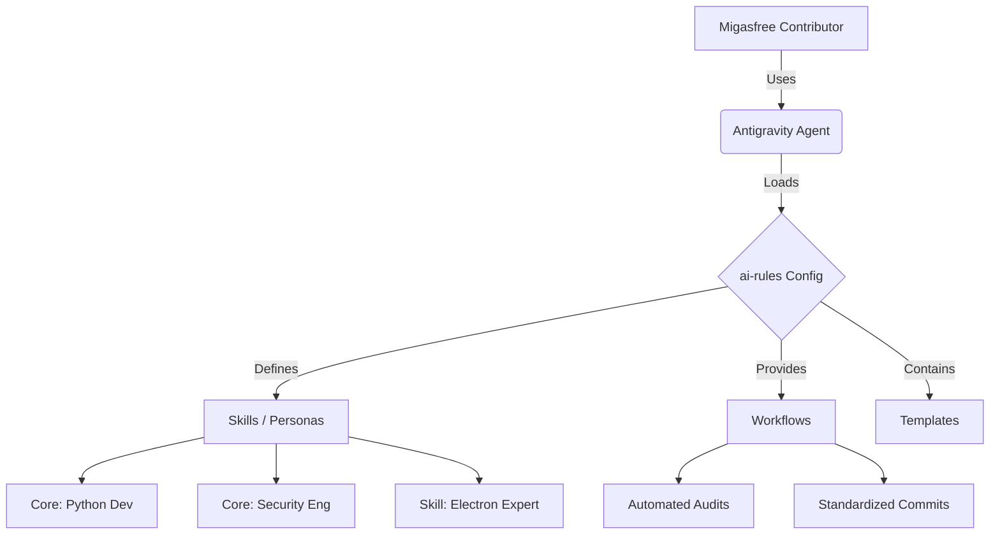

# 🤖 Migasfree AI Standards

[](https://opensource.org/licenses/MIT)
[](https://github.com/migasfree/ai-rules)

**The Official AI Specification Hub for the Migasfree Community.**

This repository serves as the central source of truth for AI interactions within the Migasfree ecosystem. It provides **normalized prompts**, **role-based personas**, and **automated workflows** to ensure consistency and quality across all contributions.

---

> **New Contributor?** 🚀 [Start with our Onboarding Guide](BOARDING.md)

## 🎯 Purpose

To empower developers, system administrators, and technical writers with a standardized AI context. By using these rules, we ensure that:

* **Code** aligns with Migasfree's architectural patterns (mTLS, Python 3.12+ compat, etc.).
* **Documentation** follows the Diátaxis framework.
* **Security** best practices are automatically verified.

---

## 🚀 Installation & Setup

To adopt the Migasfree standards, install the resources into your local Antigravity configuration.

### 🌎 Global Installation (Core Foundation)

Install the standard workflows, templates, and core roles that apply to **every** Migasfree project. This ensures the "Rules of the House" are always active.

```bash
# 1. Install Workflows & Templates
mkdir -p ~/.gemini/antigravity/global_workflows/ ~/.gemini/antigravity/templates/
cp ./workflows/*.md ~/.gemini/antigravity/global_workflows/
cp -r ./templates/* ~/.gemini/antigravity/templates/

# 2. Install Core Roles (Architect, Ops, Designer)
mkdir -p ~/.gemini/antigravity/core/
cp -r ./core/* ~/.gemini/antigravity/core/
```

### 📂 Workspace-Specific Skills (Tech Stack)

Every project is different. **Do not install all skills globally.** Instead, select and install only the skills relevant to your specific project's technology stack.

1. Create the local agent directory in your project root:

    ```bash
    mkdir -p .agent/skills
    ```

2. Copy **only** the skills you need from the `ai-rules` repository:

    ```bash
    # Example: For a Python/Django project
    cp /path/to/ai-rules/skills/languages/python-expert.md .agent/skills/
    cp /path/to/ai-rules/skills/frameworks/django-expert.md .agent/skills/
    ```

> Note: The skills are organized in subfolders (`languages`, `frameworks`, `disciplines`). Browse them to find exactly what you need.
>
> 💡 **Tip**: Use `/skill_list` to verify which skills are active in your current session.

---

## 🛠️ Standardized Workflows

These commands automate routine tasks using our community standards.

### 🧠 `/skill_generate`

*Analyzes your project structure and generates specialized technology skills.*

* **Use when**: Starting a new repository or onboarding a new project to provide specific technical context.
* **Model**: Claude Opus 4.5

### � `/audit_report`

*Performs a comprehensive quality audit covering both Core Architecture and Skill technology compliance.*

* **Use when**: Before submitting a Pull Request.
* **Output**: A detailed `role_audit_report.md` covering security, code quality, and multi-layer architecture.

### 🕵️ `/audit_report_forensic`

*Executes a Deep-Dive Technical Audit, actively searching for specific patterns and enforcing Senior Expert rules.*

* **Use when**: Analyzing legacy code, performance bottlenecks, or security incidents.
* **Output**: A "Staff Engineer" level report with forensic evidence (file paths, line numbers) and specific remediation plans.

### ✍️ `/commit`

*Generates a professional commit message following Conventional Commits.*

* **Use when**: Staging changes.
* **Features**: Automatically detects security risks in staged code before committing.

### 📋 Role Management

* `/skill_list`: View active Core roles and Skills.
* `/skill_on [skill]`: Activate a technology skill (e.g., `python-expert`).
* `/skill_off [skill]`: Deactivate a skill.

---

## 🧩 Recommended Extensions

For the best experience complying with these standards:

* **Ruff**: For enforcing our Python linting rules.
* **Markdown Preview Mermaid Support**: To view the architectural diagrams in our reports.
* **markdownlint**: To ensure documentation meets our Technical Writer standards.

---

## 📈 Architecture



---
*Maintained by the Migasfree Community.*
