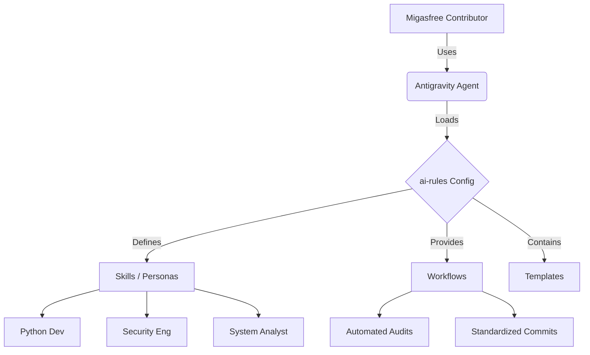

# 🤖 Migasfree AI Standards

[](https://opensource.org/licenses/MIT)
[](https://github.com/migasfree/ai-rules)

**The Official AI Specification Hub for the Migasfree Community.**

This repository serves as the central source of truth for AI interactions within the Migasfree ecosystem. It provides **normalized prompts**, **role-based personas**, and **automated workflows** to ensure consistency and quality across all contributions.

---

> **New Contributor?** 🚀 [Start with our Onboarding Guide](BOARDING.md)

## 🎯 Purpose

To empower developers, system administrators, and technical writers with a standardized AI context. By using these rules, we ensure that:

* **Code** aligns with Migasfree's architectural patterns (mTLS, Python 3.6+ compat, etc.).
* **Documentation** follows the Diátaxis framework.
* **Security** best practices are automatically verified.

---

## 🚀 Installation & Setup

To adopt the Migasfree standards, install the resources into your local Antigravity configuration.

### 🌎 Global Installation (Recommended)

This makes the Migasfree roles and workflows available in *any* terminal session.

```bash
# 1. Install Workflows (Automation)
mkdir -p ~/.gemini/antigravity/global_workflows/
cp ./workflows/*.md ~/.gemini/antigravity/global_workflows/

# 2. Install Templates (Prompt Logic)
mkdir -p ~/.gemini/antigravity/templates/
cp -r ./templates/* ~/.gemini/antigravity/templates/

# 3. Install Skills (Role Definitions)
mkdir -p ~/.gemini/antigravity/global_skills/
cp -r ./skills/* ~/.gemini/antigravity/global_skills/
```

### 📂 Workspace-Specific Installation

If you only want these active for a specific project:

```bash
mkdir -p .agent/workflows .agent/templates .agent/skills
cp ./workflows/*.md .agent/workflows/
cp -r ./templates/* .agent/templates/
cp -r ./skills/* .agent/skills/
```

---

## 🛠️ Standardized Workflows

These commands automate routine tasks using our community standards.

### 🧠 `/generate_skills`

*Analyzes your project structure and assigns the appropriate Migasfree roles.*

* **Use when**: Starting a new repository or onboarding a new project.
* **Model**: Claude Opus 4.5

### 🛡️ `/audit_report`

*Performs a comprehensive quality audit based on active roles.*

* **Use when**: Before submitting a Pull Request.
* **Output**: A detailed `role_audit_report.md` covering security, code quality, and architecture.

### ✍️ `/commit`

*Generates a professional commit message following Conventional Commits.*

* **Use when**: Staging changes.
* **Features**: Automatically detects security risks in staged code before committing.

### 📋 Role Management

* `/skill_list`: View active roles.
* `/skill_on [role]`: Activate a role (e.g., `technical_writer`).
* `/skill_off [role]`: Deactivate a role.

---

## 🧩 Recommended Extensions

For the best experience complying with these standards:

* **Ruff**: For enforcing our Python linting rules.
* **Markdown Preview Mermaid Support**: To view the architectural diagrams in our reports.
* **markdownlint**: To ensure documentation meets our Technical Writer standards.

---

## 📈 Architecture



---
*Maintained by the Migasfree Community.*
