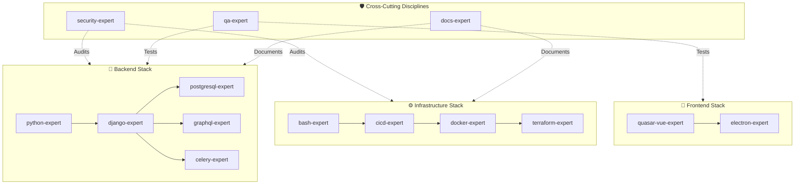

# Skill Dependency Graph

> **Purpose**: Visual reference for understanding relationships between technology skills.  
> **Last Updated**: 2026-02-05

## Overview

This diagram shows the logical dependencies and relationships between skills in the `ai-rules` ecosystem. An arrow from A → B means "A often benefits from B's context".

## Dependency Matrix

| Skill | Recommended Companions |
|-------|------------------------|
| `django-expert` | `python-expert`, `postgresql-expert` |
| `graphql-expert` | `django-expert` |
| `celery-expert` | `django-expert`, `python-expert` |
| `docker-expert` | `cicd-expert`, `bash-expert` |
| `terraform-expert` | `docker-expert`, `cicd-expert` |
| `electron-expert` | `quasar-vue-expert` |

## Usage Notes

- **Backend projects**: Start with `python-expert` + `django-expert` + `postgresql-expert`
- **Full-stack projects**: Add `quasar-vue-expert` to the backend stack
- **Desktop apps**: Use `electron-expert` + `quasar-vue-expert`
- **Infrastructure**: Use `bash-expert` + `cicd-expert` + `docker-expert`

---
*Maintained by the Migasfree AI Standards Team.*
