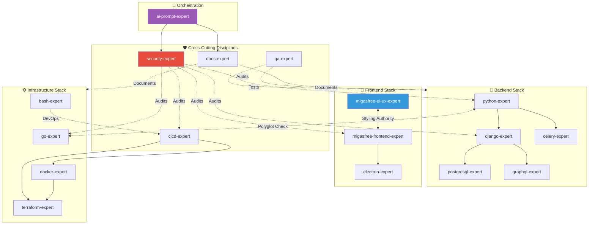

# Skill Dependency Graph

> **Purpose**: Visual reference for understanding relationships between technology skills.  
> **Last Updated**: 2026-02-07 | **Ecosystem Version**: v1.4.0

## Overview

This diagram shows the logical dependencies and relationships between skills in the `ai-rules` ecosystem. An arrow from A → B means "A depends on B's context" or "A frequently collaborates with B".



## Dependency Matrix

| Skill | Required Dependencies | Optional Companions |
| ----- | --------------------- | ------------------- |
| `django-expert` | `python-expert`, `postgresql-expert` | `security-expert`, `celery-expert` |
| `graphql-expert` | `django-expert` | - |
| `celery-expert` | `python-expert` | `django-expert`, `security-expert` |
| `migasfree-frontend-expert` | `migasfree-ui-ux-expert` | `security-expert` |
| `electron-expert` | `migasfree-frontend-expert` | - |
| `docker-expert` | - | `cicd-expert`, `bash-expert` |
| `terraform-expert` | - | `docker-expert`, `cicd-expert` |
| `cicd-expert` | - | `docker-expert`, `security-expert` |

## Usage Recommendations

### Backend Projects

```bash
# Minimal
cp -r skills/languages/python-expert/. .agent/skills/languages/python-expert/
cp -r skills/frameworks/django-expert/. .agent/skills/frameworks/django-expert/

# Full Stack
cp -r skills/frameworks/postgresql-expert/. .agent/skills/frameworks/postgresql-expert/
cp -r skills/frameworks/celery-expert/. .agent/skills/frameworks/celery-expert/
cp -r skills/disciplines/security-expert/. .agent/skills/disciplines/security-expert/
```

### Frontend Projects (Migasfree)

```bash
cp -r skills/disciplines/migasfree-ui-ux-expert/. .agent/skills/disciplines/migasfree-ui-ux-expert/
cp -r skills/frameworks/migasfree-frontend-expert/. .agent/skills/frameworks/migasfree-frontend-expert/
```

### Desktop Applications

```bash
cp -r skills/disciplines/migasfree-ui-ux-expert/. .agent/skills/disciplines/migasfree-ui-ux-expert/
cp -r skills/frameworks/migasfree-frontend-expert/. .agent/skills/frameworks/migasfree-frontend-expert/
cp -r skills/frameworks/electron-expert/. .agent/skills/frameworks/electron-expert/
```

### Infrastructure & DevOps

```bash
cp -r skills/languages/bash-expert/. .agent/skills/languages/bash-expert/
cp -r skills/disciplines/cicd-expert/. .agent/skills/disciplines/cicd-expert/
cp -r skills/frameworks/docker-expert/. .agent/skills/frameworks/docker-expert/
```

### Polyglot Projects (Python + Go)

```bash
cp -r skills/languages/python-expert/. .agent/skills/languages/python-expert/
cp -r skills/languages/go-expert/. .agent/skills/languages/go-expert/
cp -r skills/disciplines/security-expert/. .agent/skills/disciplines/security-expert/
```

## Version Notes (v1.3.0)

### Breaking Changes

- **Removed**: `quasar-vue-expert` (merged into `migasfree-frontend-expert`)
- **Standardized**: All skills now follow 6-Pillar Protocol
- **Dependencies**: Explicit YAML frontmatter declarations required

### New Features

- Polyglot awareness checks between Python and Go
- Security expert as universal dependency
- Cross-skill orchestration via `ai-prompt-expert`

---
*Maintained by the Migasfree AI Standards Team.*
