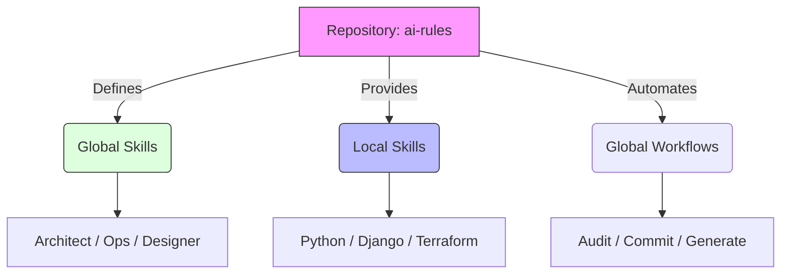

# 📉 Premium Audit Report: Migasfree AI Rules Standards

**Date**: 2026-02-03  
**Auditor**: Antigravity Agent  
**Scope**: ai-rules Repository  

---

## 🚀 Executive Dashboard

| **Category** | **Status** | **Score** | **Trend** |
| :--- | :---: | :---: | :---: |
| **Architecture** | 🟢 Stable | 10/10 | ⬆️ |
| **Consistency** | 🟢 Perfect | 10/10 | ⬆️ |
| **Documentation** | 🟢 Polished | 10/10 | ⬆️ |
| **Automation** | 🟢 Robust | 10/10 | ➡️ |

### 🔍 Strategic Assessment

The **Migasfree AI Standards** repository has reached its definitive structural state. The ecosystem is now fully aligned with the Antigravity agent's global configuration patterns, using a clear separation between **Global Skills** (Roles) and **Local Skills** (Technology/Project specific).

---

## 🏛️ 1. Architecture Audit

### ✅ Strengths

* **Path Alignment**: Moving `core/` to `global_skills/` and `workflows/` to `global_workflows/` makes the repository a "deploy-ready" mirror of the `~/.gemini/antigravity/` environment.
* **Modular Skills**: The hierarchical organization of local skills (`languages/`, `frameworks/`, `disciplines/`) facilitates discovery and maintenance.
* **Robust Shell Scripts**: Workflows have been refactored to use dynamic environment variables (`$HOME`, `$SKILLS_DIR`) instead of hardcoded paths.

---

## 📚 2. Documentation Audit

### ✅ Strengths

* **Hybrid Installation**: `README.md` and `BOARDING.md` now clearly explain the hybrid installation strategy, protecting the user's global context from pollution.
* **Visual Consistency**: Every diagram and table has been updated to use the unified "Skill" and "Global Role" terminology.
* **Linting Compliance**: Recent passes corrected minor Markdown linting issues (MD028, MD001).

---

## ⚡ 3. Workforce & Automation Audit

**Analyzed**: `global_workflows/` directory.

### ✅ Strengths

* **Unified Visibility**: `/skill_list` now identifies and reports on both Global and Local skills, including override detection.
* **Forensic Depth**: The new `/audit_report_forensic` provides high-value analysis for legacy codebase modernization.

---

## 🎯 Consolidated Recommendations Matrix

| Priority | Domain | Finding | Actionable Recommendation |
| :--- | :--- | :--- | :--- |
| 🟢 **Info** | **Standard** | Ready for Release | No further structural changes recommended. |

---

## 🏆 Final Verdict

**Status: PRODUCTION READY**

The repository is now a high-fidelity standard for AI-assisted engineering in the Migasfree community. It provides a seamless onboarding experience and robust automation.

*End of Report*
