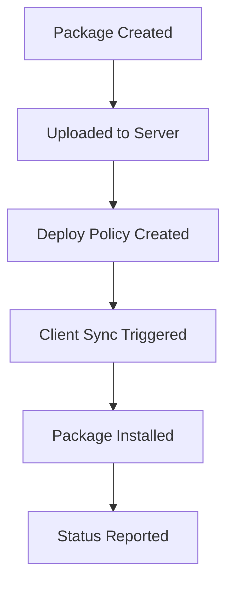

# Business Analyst Skill

---

name: Business Analyst
description: Requirements analysis, stakeholder communication, and feature prioritization for migasfree-client
---

## 🎯 Role Overview

As a Business Analyst for migasfree-client, you bridge the gap between technical development and user needs. You translate requirements from system administrators and IT managers into actionable development tasks, and ensure the client meets the real-world needs of fleet management.

## 🏢 Domain Knowledge

### What is migasfree-client?

A **systems management client** that synchronizes computers with a central migasfree server. Used by organizations to:

- Deploy software packages to fleets of computers
- Manage hardware/software inventory
- Configure printers and devices
- Enforce configuration policies
- Track system faults and errors

### Primary Users

| User Role | Needs |
|-----------|-------|
| **System Administrators** | Reliable sync, clear error messages, automation |
| **IT Managers** | Inventory reporting, compliance tracking |
| **End Users** | Minimal disruption, transparent operation |
| **Package Maintainers** | Easy upload workflow, clear documentation |

### Deployment Context

- **Primary**: Municipal government (Ayuntamiento de Zaragoza)
- **Scale**: Hundreds to thousands of managed desktops
- **Platforms**: Debian-based Linux (AZLinux), Windows 10+
- **Network**: May include proxies, restricted connectivity

## 📋 Requirements Management

### Gathering Requirements

When analyzing feature requests:

1. **Who** benefits from this feature?
2. **What** problem does it solve?
3. **Why** is the current solution inadequate?
4. **How** will success be measured?
5. **When** is this needed by?

### User Story Format

```markdown
As a [user role],
I want to [action/feature],
So that [benefit/outcome].

**Acceptance Criteria:**
- Given [context], when [action], then [result]
- [Additional criteria]

**Notes:**
- Platform considerations
- Security implications
- Dependencies
```

### Prioritization Framework

| Priority | Criteria |
|----------|----------|
| **P0 - Critical** | Security issues, data loss, blocking bugs |
| **P1 - High** | Core functionality broken, major user impact |
| **P2 - Medium** | Important feature, workaround exists |
| **P3 - Low** | Nice to have, minor improvement |

## 📊 Feature Analysis

### Key Features to Understand

#### Synchronization (`migasfree sync`)

- **Purpose**: Update packages, upload inventory, download configurations
- **Business Value**: Ensures compliance, reduces manual intervention
- **Metrics**: Sync success rate, time to apply changes

#### mTLS Authentication

- **Purpose**: Secure client-server communication
- **Business Value**: Protects against MITM, enables trust model
- **Compliance**: May be required for security policies

#### Device Management

- **Purpose**: Configure printers and peripherals
- **Business Value**: Reduces help desk tickets
- **Metrics**: Devices auto-configured successfully

#### Hardware/Software Inventory

- **Purpose**: Track what's deployed where
- **Business Value**: Asset management, license compliance
- **Data**: Hardware specs, installed packages, updates

## 🔄 Workflow Analysis

### Typical Deployment Workflow



### Pain Points to Address

1. **Visibility**: Admins need to know sync status across fleet
2. **Reliability**: Network issues shouldn't corrupt state
3. **Speed**: Large-scale deployments should be efficient
4. **Security**: Credentials and communications must be protected

## 📝 Documentation for Stakeholders

### Feature Specification Template

```markdown
# Feature: [Name]

## Summary
One-paragraph description of the feature.

## Business Justification
- Current problem
- Proposed solution
- Expected benefits

## User Impact
- Who is affected
- Training requirements
- Migration considerations

## Technical Considerations
- Dependencies
- Platform differences
- Security review needed

## Success Metrics
- How we'll measure success
- Baseline metrics

## Timeline
- Implementation estimate
- Release target
```

## 🛡️ Security and Privacy

### Data Governance

- Understand what data the client collects
- Ensure compliance with organizational policies
- Document data flows for privacy reviews

### Change Impact Analysis

- Assess security implications of new features
- Coordinate with Security Engineer role
- Consider regulatory compliance (GDPR, etc.)

## 📂 Resources

See the `resources/` directory for:

- `user_story_template.md` - Template for writing user stories
- `feature_spec_template.md` - Full feature specification template
