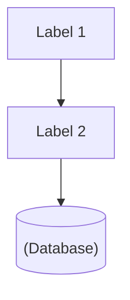

# Atomic Mermaid Diagram Template

Use this template to ensure maximum reliability and prevent parsing errors.

## Structure

## Rules

1. **Double Newline**: Always leave a blank line after `graph TD`.
2. **Alphanumeric IDs**: Use simple, uppercase identifiers (e.g., `FW`, `SRV`, `LB`).
3. **No Quotes at Start**: Never start a logic line with a quote. Define the ID first.
4. **Indentation**: Indent all content under the graph declaration.
