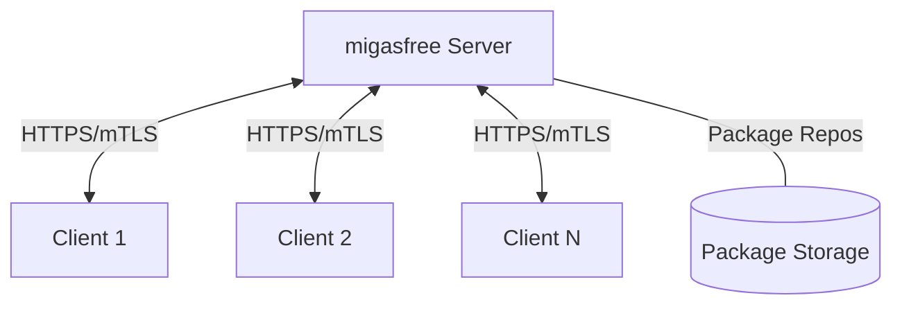
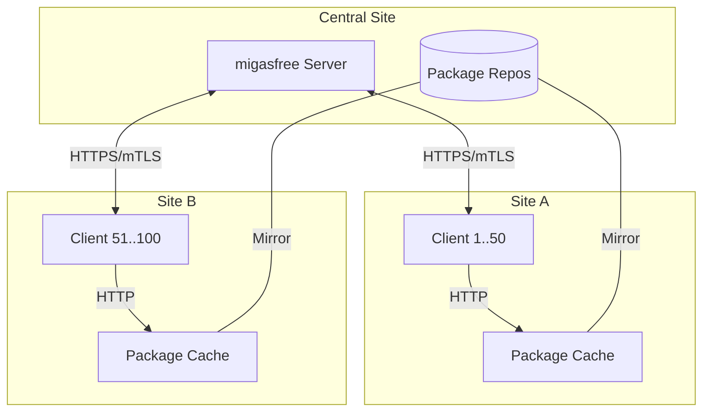
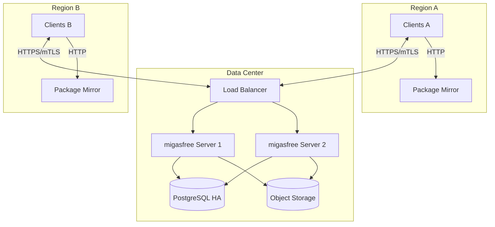

# Deployment Architecture Template

## Overview

This document describes deployment architecture options for migasfree-client in your environment.

## Small Deployment (< 100 computers)



### Characteristics

- Single server handles all connections
- Direct package downloads from server
- Suitable for single-site deployments

### Requirements

- Server: 2 CPU, 4GB RAM, 50GB storage
- Network: Standard LAN connectivity
- mTLS: Optional but recommended

---

## Medium Deployment (100-1000 computers)



### Characteristics

- Package cache per site (apt-cacher-ng)
- Reduces WAN bandwidth for package downloads
- API calls still go to central server

### Requirements

- Server: 4 CPU, 8GB RAM, 200GB storage
- Package Cache: 2 CPU, 2GB RAM, 100GB storage per site
- Network: Site-to-site connectivity with adequate bandwidth

### Configuration

**Client config for caching:**

```ini
[client]
Server = migasfree.central.example.com
Protocol = https
Package_Proxy_Cache = cache.local.example.com:3142
```

---

## Large Deployment (1000+ computers)



### Characteristics

- High availability server cluster
- Regional package mirrors
- Database replication
- Object storage for packages

### Requirements

- Load Balancer: HAProxy or nginx
- Servers: 8 CPU, 16GB RAM each (min 2)
- Database: PostgreSQL with replication
- Storage: S3-compatible object storage
- Package Mirrors: 4 CPU, 4GB RAM, 500GB storage

---

## Network Requirements

### Firewall Rules

| Source | Destination | Port | Protocol | Purpose |
|--------|-------------|------|----------|---------|
| Clients | Server | 443 | HTTPS | API + mTLS |
| Clients | Package Cache | 3142 | HTTP | Package downloads |
| Server | Database | 5432 | TCP | PostgreSQL |

### Bandwidth Estimation

| Activity | Per Client | 100 Clients/day |
|----------|------------|-----------------|
| Sync API | ~50KB | ~5MB |
| Full Update | ~200MB | ~20GB |
| Inventory Upload | ~20KB | ~2MB |

---

## High Availability Considerations

### Server Failover

- Use load balancer health checks
- Database connection pooling (PgBouncer)
- Session affinity not required (stateless API)

### Certificate Management

- Clients store certificates locally
- Certificate renewal should be automated
- CA certificate distribution via initial sync

### Monitoring

```bash
# Key metrics to monitor
- Server response time
- Sync success rate
- Certificate expiration
- Package cache hit rate
- Database connection pool
```

---

## Security Considerations

### Network Segmentation

- Management network for server access
- Client network (may be untrusted)
- Database network (isolated)

### mTLS Deployment

1. Generate CA on secure system
2. Deploy CA certificate to all clients
3. Clients request individual certificates
4. Monitor certificate expiration

### Audit Logging

- Log all API requests
- Track package installations
- Monitor authentication failures
